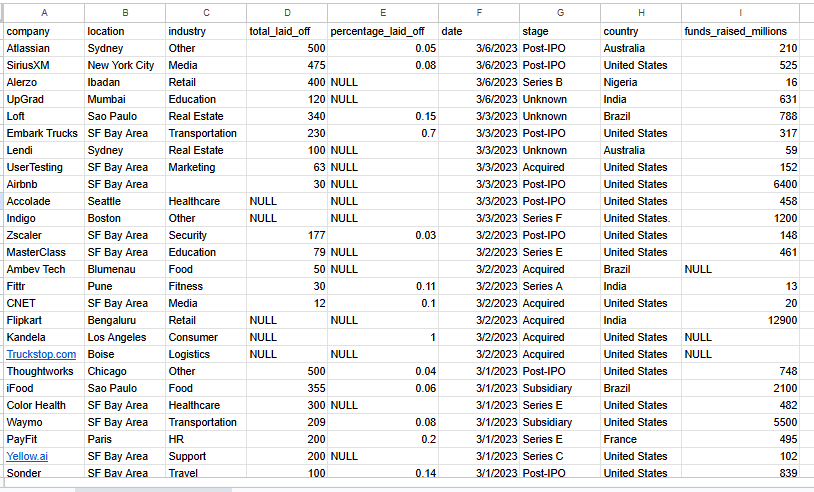
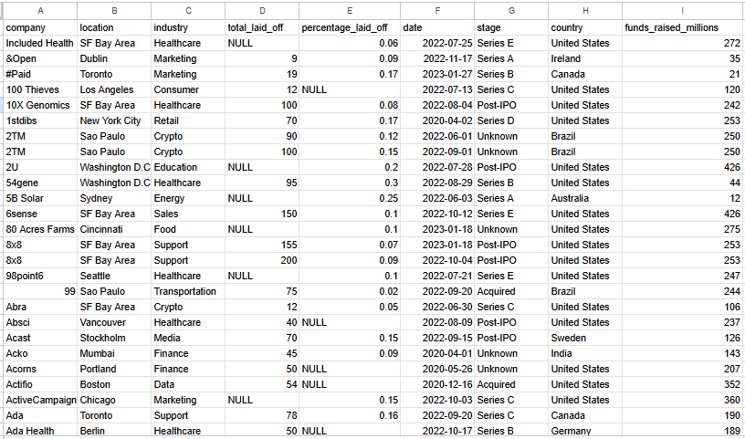
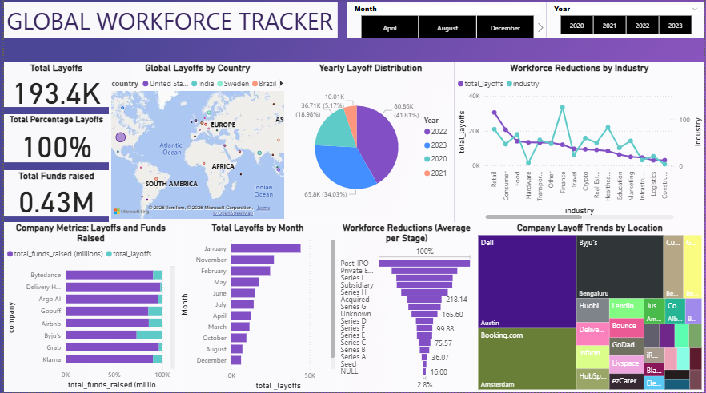
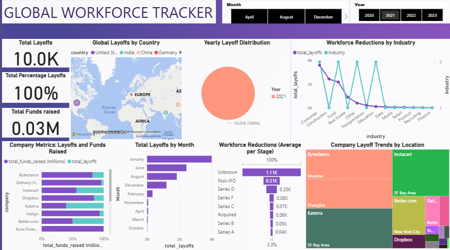
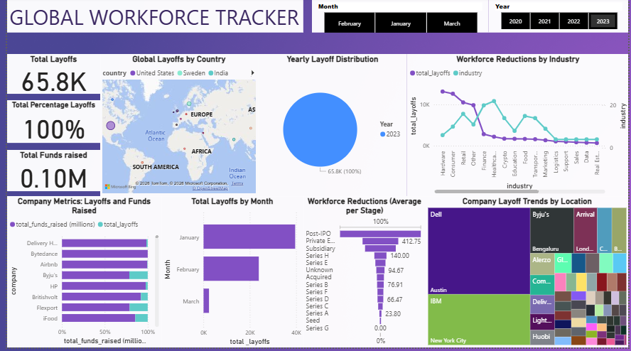
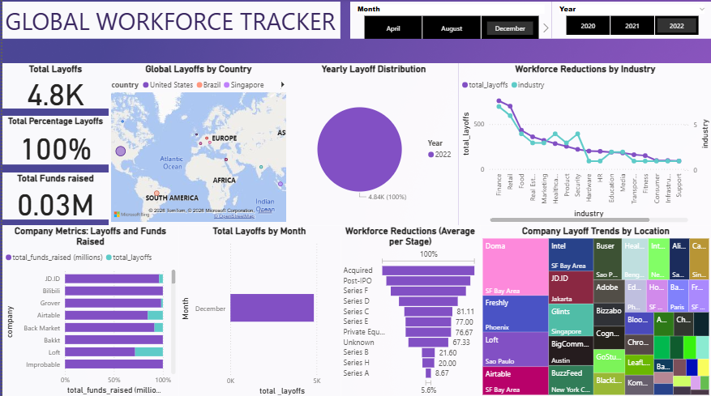
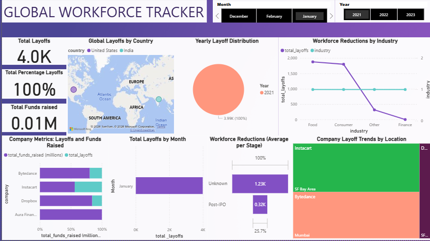
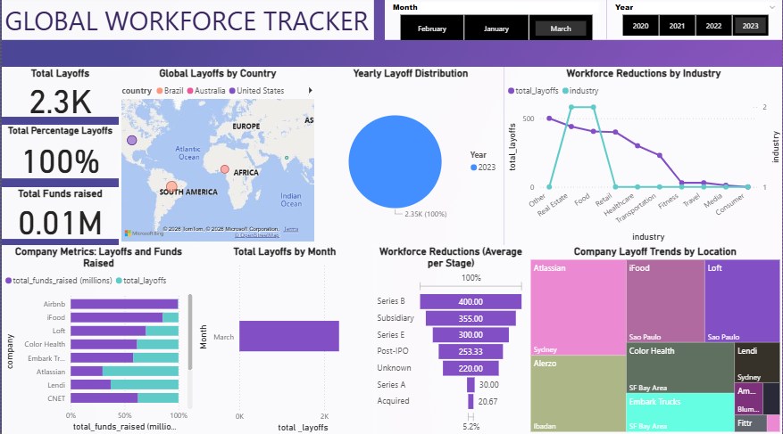

# Global_Layoffs Analytics

## Overview

Global_Layoffs Analytics is more than just a dataset; it’s a lens into the shifting dynamics of the global workforce.  
By combining **SQL-powered data cleaning** with **Power BI visual storytelling**, this project transforms raw layoff records into meaningful insights about how companies, industries, and regions respond to economic pressures.

## Why This Matters
Layoffs are not just numbers; they reflect broader trends in funding, growth, and resilience.  
This repository helps uncover:
- Which industries are most affected
- How funding levels relate to workforce reductions
- Geographic patterns of layoffs across countries
- Monthly and yearly trends in employment cuts

## Contents
- **Cleaned Dataset** → Reliable, structured data ready for analysis  
- **SQL Scripts** → Transparent cleaning and preprocessing steps  
- **Power BI Dashboards** → Interactive visuals for exploring trends  
- **Documentation** → Methodology and definitions for clarity  

## Goal
To provide researchers, analysts, and curious minds with a clear, data-driven view of global layoffs; turning scattered records into actionable knowledge.
  
# Global_Layoffs Analytics – Dataset Fields

- **Company** → Name of the company  
- **Location** → City or region where the company operates  
- **Industry** → Sector the company belongs to (e.g., Tech, Health, Finance)  
- **Total_Laid_Off** → Number of employees laid off  
- **Percentage_Laid_Off** → Proportion of workforce laid off (decimal format, e.g., 0.15 = 15%)  
- **Date** → Date of the layoff event  
- **Stage** → Company stage (Startup, Growth, Established, etc.)  
- **Country** → Country of operation  
- **Funds_Raised (millions)** → Total funding raised in millions  

---
# Raw Dataset




# step 1: Data Cleaning Process (SQL)
   
## a.Creating a Replica of the Dataset

- To preserve the original data, I first created a staging table (raw_layoff_stagging) as a copy of the main layoffs table.

- This allowed me to perform cleaning operations without altering the raw dataset.

## b. Identifying Duplicates with Row Numbers

- I used the ROW_NUMBER() function with a PARTITION BY clause across all key columns (company, location, industry, total_laid_off, percentage_laid_off, date, stage, country, funds_raised_millions).

- This assigned a sequential number to each row within identical groups, making it possible to detect duplicates.

# c.Creating a Second Staging Table with Row Numbers

- I then created a new table (raw_layoff_stagging2) that included the row_num column as part of the schema.

- This ensured that duplicates could be tracked directly within the table.

## d. Removing Duplicate Rows

- Finally, I deleted all rows where row_num > 1, leaving only the first occurrence of each unique record.

- This step effectively cleaned the dataset by removing duplicate entries while keeping one valid copy of each record.


```sql
-- Step 1: Create a replica of the dataset to preserve raw data
CREATE TABLE raw_layoff_stagging LIKE layoffs;

INSERT INTO raw_layoff_stagging
SELECT *
FROM layoffs;

-- Step 2: Assign row numbers to identify duplicates
WITH duplicate_cte AS (
    SELECT
        *,
        ROW_NUMBER() OVER(
            PARTITION BY company, location, industry, total_laid_off, 
                         percentage_laid_off, `date`, stage, country, funds_raised_millions
        ) AS row_num
    FROM raw_layoff_stagging
)
SELECT *
FROM duplicate_cte
WHERE row_num > 1;

-- Step 3: Create a second table including row_num
CREATE TABLE raw_layoff_stagging2 (
  company TEXT,
  location TEXT,
  industry TEXT,
  total_laid_off INT DEFAULT NULL,
  percentage_laid_off TEXT,
  `date` TEXT,
  stage TEXT,
  country TEXT,
  funds_raised_millions INT DEFAULT NULL,
  row_num INT
) ENGINE=InnoDB DEFAULT CHARSET=utf8mb4 COLLATE=utf8mb4_0900_ai_ci;

INSERT INTO raw_layoff_stagging2
SELECT
    *,
    ROW_NUMBER() OVER(
        PARTITION BY company, location, industry, total_laid_off, 
                     percentage_laid_off, `date`, stage, country, funds_raised_millions
    ) AS row_num
FROM raw_layoff_stagging;

-- Step 4: Delete duplicate rows (row_num > 1)
DELETE
FROM raw_layoff_stagging2
WHERE row_num > 1;
```

# Step 2: Standardizing Data

## a. Removing White Spaces in Company Names
- During inspection, trailing and leading white spaces were discovered in the `company` column.  
- These were trimmed using the `TRIM()` function and then updated in the table.

```sql
-- Check for white spaces
SELECT company, TRIM(company)
FROM raw_layoff_stagging2;

-- Update the column with trimmed values
UPDATE raw_layoff_stagging2
SET company = TRIM(company);
```

## b. Cleaning Industry Column

- The industry column contained inconsistencies such as short names or discrepancies in naming.

- First, distinct values were checked to identify variations.

- Then, specific cases (e.g., industries starting with "Crypto") were standardized to a clean name.

```sql
-- Inspect distinct industry values
SELECT DISTINCT industry
FROM raw_layoff_stagging2
ORDER BY 1;

-- Check for discrepancies (example: Crypto variations)
SELECT DISTINCT *
FROM raw_layoff_stagging2
WHERE industry LIKE 'Crypto%';

-- Update industry names to standardized values
UPDATE raw_layoff_stagging2
SET industry = 'Cryptocurrency'
WHERE industry LIKE 'Crypto%';
```

# Step 3: Final Data Cleaning and Standardization

## a. Altering Table Columns
- The `date` column was originally created as `TEXT`.  
- To ensure proper date handling, it was altered to the correct `DATE` type.

```sql
ALTER TABLE raw_layoff_stagging2
MODIFY COLUMN `date` DATE;
```

## b. Handling NULL and Blank Values

- Checked for rows where both total_laid_off and percentage_laid_off were NULL.

- Replaced blank industry values with NULL for consistency.

```sql
-- Identify NULL values
SELECT *
FROM raw_layoff_stagging2
WHERE total_laid_off IS NULL
AND percentage_laid_off IS NULL;

-- Replace blank industry values with NULL
UPDATE raw_layoff_stagging2
SET industry = NULL
WHERE industry = '';
```

## c. Populating Missing Industry Values

- Used a self‑join to populate missing industry values based on other rows of the same company.

- Example: Airbnb rows with blank industry were updated to "Travel" using existing records.

```sql
-- Identify missing industry values
SELECT rls1.industry, rls2.industry
FROM raw_layoff_stagging2 AS rls1
JOIN raw_layoff_stagging2 AS rls2
    ON rls1.company = rls2.company
WHERE (rls1.industry IS NULL OR rls1.industry = '')
AND rls2.industry IS NOT NULL;

-- Update missing industry values
UPDATE raw_layoff_stagging2 AS rls1
JOIN raw_layoff_stagging2 AS rls2
    ON rls1.company = rls2.company
SET rls1.industry = rls2.industry
WHERE rls1.industry IS NULL
AND rls2.industry IS NOT NULL;
```

## d. Removing Useless NULL Records

- Rows where both total_laid_off and percentage_laid_off were NULL were deleted.

- These records would negatively affect visualizations.

```sql
DELETE
FROM raw_layoff_stagging2
WHERE total_laid_off IS NULL
AND percentage_laid_off IS NULL;
```

## e. Dropping Helper Columns

- The row_num column was dropped since it was only used for duplicate detection.

```sql
ALTER TABLE raw_layoff_stagging2
DROP COLUMN row_num;
```

## f. Finalizing the Clean Dataset

- Verified the cleaned dataset and finalized it for analysis.

```sql
SELECT *
FROM world_layoffs_2.raw_layoff_stagging2;
```




---

# General Dashboard 1 – Global Workforce Tracker



The general dashboard provides a **comprehensive snapshot** of global layoffs, combining all charts into a single view.  
It shows **193.4k total layoffs**, **0.43 million in funds raised**, and an overall **100% workforce reduction percentage**.

## Key Finding

The data reveals that layoffs are unevenly distributed across industries, geographies, and company stages.  
Retail and Consumer sectors have been the hardest hit, showing persistent vulnerability compared to other industries.  
Geographically, the United States consistently leads in layoffs, followed by India and Sweden, highlighting regional concentration.  
Yearly trends show that 2022 recorded the highest layoffs, with 2023 close behind, while 2021 surprisingly had the least despite the global impact of COVID.  
Stage analysis indicates that Seed and Series A companies experienced the least average layoffs, suggesting resilience at early funding stages.  
Monthly patterns reveal clear seasonal spikes, with January consistently topping the charts, followed by November.  
Together, these insights highlight cyclical, regional, and industry‑specific behaviors that shape the broader narrative of global workforce reductions.  


# Dashboard 2 – Year 2021 Filter



# Key Finding

The second dashboard focuses on layoffs in **2021**, a year still shaped by the aftermath of COVID‑19.  
Despite global challenges, total layoffs stood at **10k**, making it the **lowest year** compared to 2022 and 2023.  
The **Education industry** recorded 102 layoffs, while the **Finance industry** had none, showing uneven impact across sectors.  
This suggests that certain industries were more resilient, even during a difficult recovery period.  
On the company side, **Aura Financial** stood out with the **highest fund raise**, highlighting strong investor confidence despite zero layoffs in its sector.  
The data emphasizes that 2021 was surprisingly less severe in terms of workforce reductions, even though the world was still adjusting to post‑COVID realities.  
Overall, the dashboard shows that layoffs were limited in scale, concentrated in specific industries, and contrasted sharply with the larger cuts seen in later years.  
This makes 2021 an anomaly in the broader layoff trend, offering insights into how recovery and resilience varied across industries and companies.  


# Dashboard 3 – Year 2023 Filter



# Key Finding

The third dashboard focuses on layoffs in **2023**, which recorded a total of **65.8k layoffs**, a sharp increase compared to 2021 with the lowest figures.  
The **United States** dominated geographically, accounting for **48.011k layoffs**, far ahead of other countries.  
In terms of industries, **Hardware** experienced the highest layoffs, while **Real Estate** had the least, showing contrasting sector impacts.  
Interestingly, **Airbnb** stood out with the **highest fund raise** but reported **no layoffs**, highlighting strong resilience.  
Company stage analysis revealed that **Series G stage firms had zero layoffs**, suggesting stability at later funding stages.  
This year’s data emphasizes how layoffs were concentrated in specific industries and regions, while some well‑funded companies managed to avoid workforce reductions.  
Overall, 2023 reflects a period of significant workforce cuts, especially in the U.S. and Hardware sector, contrasting with the resilience of select firms and stages.  
 

# Dashboard 4 – December 2022 Filter



# Key Finding 

The fourth dashboard highlights layoffs in **December 2022**, a month that recorded **4.8k total layoffs**.  
Despite the global trend, **China reported zero layoffs**, showing regional resilience.  
In terms of industries, **Finance** had the highest layoffs, followed closely by **Retail**, reflecting sector‑specific pressures.  
At the company level, **Improbable** stood out by receiving the **highest funding** while reporting **no layoffs**, signaling investor confidence and operational stability.  
Meanwhile, **Doma**, located in the **SF Bay Area**, recorded the **highest company layoffs by location**, underscoring regional concentration.  
This month’s data reveals a sharp contrast between companies that secured funding without workforce cuts and those that faced significant reductions.  
Overall, December 2022 illustrates how layoffs were unevenly distributed across industries and geographies, with Finance and Retail hit hardest while some firms remained resilient.  


# Dashboard 5 – January 2021 Filter



# Key Finding

The fifth dashboard highlights layoffs in **January 2021**, which recorded the **lowest total layoffs of 4.0k**.  
The **Food industry** had the highest layoffs, followed by **Consumer**, while **Finance** reported the least.  
At the company level, **Instacart** stood out with the **least fund raised but the highest layoffs**, showing a sharp imbalance between funding and workforce stability.  
Stage analysis revealed that the **Unknown stage** had the highest average layoffs, suggesting uncertainty in classification may correlate with instability.  
Geographically, **Instacart**, located in the **SF Bay Area**, recorded the highest layoffs, reinforcing regional concentration.  
This pattern indicates that companies in the **SF Bay Area** were disproportionately affected compared to other regions.  
The data raises an important question: *What exactly is happening in this location that drives such high layoffs?*  
Overall, January 2021 reflects both the lowest global layoffs and a localized crisis in the SF Bay Area, particularly within Food and Consumer industries.  


# Dashboard 6 – March 2023 Filter



# Key Finding

The sixth dashboard highlights layoffs in **March 2023**, which recorded a total of **2.3k layoffs**, lower than January 2021.  
Geographically, **Brazil led with 745 layoffs**, followed by **Australia with 600**, showing regional concentration outside the U.S. this month.  
At the company level, **Airbnb** achieved the **highest fund raise with zero layoffs**, while **iFood** reported 355 layoffs.  
**Atlassian**, located in Sydney, recorded the **highest company layoffs**, followed by **Alerzo in Ibadan**, emphasizing localized impacts.  
The **Customer industry** reported **zero layoffs**, showing resilience compared to other sectors.  
Stage analysis revealed that **Series B companies had the highest layoffs**, while the **Acquired stage** recorded the least.  
This month’s data highlights a mix of resilience and vulnerability, with some firms avoiding cuts despite raising funds, while others faced significant reductions.  
Overall, March 2023 reflects relatively low global layoffs but notable regional and stage‑specific disparities.  

---

## Dashboards Summary
The dashboards reveal a pattern of escalation after 2021, with layoffs intensifying in 2022 and 2023. Industries behave unevenly; Retail and Consumer are persistently vulnerable, while Finance swings between resilience and crisis. 
Geography shows the U.S. as the epicenter, but regional spikes in Brazil, Australia, and the SF Bay Area highlight localized crises. Company behavior diverges sharply: well‑funded firms like Airbnb and Improbable avoid layoffs, while underfunded firms like Instacart suffer heavily.
Stage analysis suggests resilience at both early and very late stages, with mid‑stage firms more exposed. Monthly data underscores cyclical spikes, especially in January and November.  

---

## Tools and Technologies
- **Data Visualization**: Power BI, Tableau (for charts and dashboards).  
- **Data Processing**: Python (Pandas, NumPy), SQL for querying datasets.  
- **Collaboration**: GitHub for version control.  .  

---

## Project Learnings
- **Layoffs are not evenly distributed**; they vary by **industry, geography, and company stage**.  
- **Funding does not guarantee stability**; some well‑funded firms still faced cuts, while others avoided them.  
- **Regional hotspots** like the SF Bay Area consistently show higher layoffs, raising questions about local dynamics.  
- **Timing matters**: January and November often show spikes, suggesting cyclical or seasonal influences.  
- Dashboards help uncover **hidden patterns** that raw data alone cannot reveal.  

---

## Author
 **Blessing-Chinaza**
 Data Analyst| Medical Laboratory Scientist| Virtual Assistant

---

## Contact
[LinkedIn](https://www.linkedin.com/in/blessing-nwokike/)

*Feel free to connect for collaborations, projects, or professional opportunities.*  
 
---

## How to Use

To explore this project locally:

```bash
# Clone the repository

git clone https://github.com/Blessing-Chinaza/Global_Layoffs-Analytics.git

